# 🖥️ PC Gamer Store - Ecommerce Responsivo

> **Proyecto práctico de diseño web — Semana 19**
> 🎯 **Objetivo:** Implementar Flexbox, CSS Grid y diseño responsivo
> 🎨 **Tema:** Tienda de hardware y periféricos para gamers

## 📋 Descripción del Proyecto

Ecommerce estático completamente responsivo desarrollado con **HTML5 semántico**, **CSS3 avanzado** y **JavaScript vanilla**. El sitio demuestra el uso profesional de **Flexbox**, **CSS Grid** y un carrito de compras funcional con persistencia en **localStorage**.

## 🎨 Características Técnicas

### 📱 **Diseño Responsivo**
- **Móvil (<768px):** Menú colapsable, productos en 1 columna
- **Tablet (768px–991px):** 2 columnas de productos, navegación optimizada
- **Desktop (992px+):** Grid automático con `auto-fill`, experiencia completa

### 🛠️ **Tecnologías Implementadas**
- **Flexbox:** Navegación, tarjetas de producto y layout base
- **CSS Grid:** Catálogo (`auto-fill minmax(250px, 1fr)`), footer (4 columnas) y carrito (2fr / 1fr)
- **JavaScript:** Carrito de compras con clase `ShoppingCart` y `localStorage`
- **Google Fonts:** Tipografía Montserrat
- **HTML5 Semántico:** `<header>`, `<nav>`, `<main>`, `<section>`, `<footer>`

### 🎯 **Características del Ecommerce**
- 🏠 **Página principal** con productos destacados y banner
- 🛍️ **Catálogo de productos** con grid responsivo
- 🛒 **Carrito funcional** con contador, notificaciones y resumen
- 📝 **Formulario de registro** de usuarios
- 📬 **Página de contacto** con formulario
- 🚫 **Página 404** personalizada

## 📁 Estructura del Proyecto

```mermaid
flowchart TD
    ROOT["📁 PCGamerStore/"]

    ROOT --> IDX["📄 index.html\nPágina principal"]
    ROOT --> PROD["📄 productos.html\nCatálogo"]
    ROOT --> CART["📄 carrito.html\nCarrito de compras"]
    ROOT --> CONT["📄 contacto.html\nContacto"]
    ROOT --> REG["📄 registro.html\nRegistro de usuarios"]
    ROOT --> ERR["📄 404.html\nPágina de error"]
    ROOT --> README["📄 README.md\nDocumentación"]

    ROOT --> CSS["📁 css/"]
    CSS --> STYLES["🎨 styles.css\nEstilos + Responsivo"]

    ROOT --> JS["📁 js/"]
    JS --> CARTJS["⚙️ cart.js\nLógica del carrito"]

    ROOT --> IMG["📁 img/"]
    IMG --> BANNER["🖼️ banner.jpg"]
    IMG --> LOGO["🖼️ logo.png"]
    IMG --> PERFIL["🖼️ perfil.png"]

    IMG --> DEST["📁 destacados/"]
    DEST --> D1["🖼️ dest1.jpg"]
    DEST --> D2["🖼️ dest2.jpg"]
    DEST --> D3["🖼️ dest3.jpg"]

    IMG --> PRODS["📁 productos/"]
    PRODS --> P1["🖼️ prod1.jpg"]
    PRODS --> P2["🖼️ prod2.jpg"]
    PRODS --> P3["🖼️ prod3.jpg"]
    PRODS --> P4["🖼️ prod4.jpg"]

    IMG --> CAPS["📁 capturas/"]
    CAPS --> C1["🖼️ home.png"]
    CAPS --> C2["🖼️ productos.png"]
    CAPS --> C3["🖼️ carrito.png"]
    CAPS --> C4["🖼️ contacto.png"]
    CAPS --> C5["🖼️ registro.png"]
```



## 🎨 Breakpoints Implementados

### 📱 **Móvil (<768px)**
```css
@media (max-width: 768px)
```
- ✅ Botón hamburguesa con menú colapsable
- ✅ Catálogo en 1 columna
- ✅ Carrito adaptado verticalmente
- ✅ Sin scroll horizontal

### 📊 **Tablet (768px–991px)**
```css
@media (max-width: 992px)
```
- ✅ 2 columnas de productos
- ✅ Footer en 2 columnas
- ✅ Carrito en columna simple

### 💻 **Desktop (992px+)**
- ✅ Grid automático `auto-fill minmax(250px, 1fr)`
- ✅ Footer de 4 columnas
- ✅ Layout carrito `2fr / 1fr`
- ✅ Hover effects completos

## 📸 Capturas de Pantalla

> Las capturas se encuentran en la carpeta `img/capturas/`.

### 🏠 Página Principal


*Vista desktop con productos destacados y navegación principal*

### 🛍️ Catálogo de Productos


*Grid responsivo de productos con badges de descuento y efectos hover*

### 🛒 Carrito de Compras


*Vista del carrito con resumen de compra y controles de cantidad*

### 📬 Página de Contacto


*Formulario de contacto con diseño responsivo*

### 📝 Registro de Usuario


*Formulario de registro con validación de campos*

## 🛠️ Implementación Técnica

### 📦 **Catálogo con CSS Grid**
```css
.products-grid {
    display: grid;
    grid-template-columns: repeat(auto-fill, minmax(250px, 1fr));
    gap: 2rem;
    padding: 2rem;
}
```

### 🛒 **Layout del Carrito**
```css
.cart-container {
    display: grid;
    grid-template-columns: 2fr 1fr;
    gap: 2rem;
    max-width: 1200px;
    margin: 0 auto;
}
```

### 🧭 **Navegación con Flexbox**
```css
nav ul {
    display: flex;
    justify-content: flex-start;
    list-style: none;
    gap: 1.5rem;
}
```

### ⚙️ **Carrito con localStorage**
```js
class ShoppingCart {
    constructor() {
        this.items = this.loadCart(); // Persiste en localStorage
        this.init();
    }
}
```

## 🎨 Paleta de Colores

| Token | Color | Uso |
|-------|-------|-----|
| Fondo principal | `#1a1a2e` | Background del body |
| Fondo header | `#0f3460` | Barra de navegación |
| Fondo tarjeta | `#16213e` | Cards de producto |
| Acento / hover | `#e94560` | Botones y resaltados |
| Texto base | `#e0e0e0` | Contenido general |

## 🚀 Buenas Prácticas Aplicadas

### 📋 **Organización del Código**
- ✅ CSS modular con comentarios descriptivos por sección
- ✅ Nomenclatura consistente (`.product-card`, `.cart-container`)
- ✅ Separación de responsabilidades (HTML / CSS / JS)

### 🎯 **Accesibilidad**
- ✅ HTML5 semántico correcto
- ✅ Contraste adecuado (fondo oscuro / texto claro)
- ✅ Navegación por teclado posible
- ✅ Textos alternativos en imágenes

### ⚡ **Optimización**
- ✅ Sin scroll horizontal en ningún breakpoint
- ✅ Transiciones con `cubic-bezier` para suavidad
- ✅ `transform` y `box-shadow` para efectos GPU
- ✅ `object-fit` en imágenes de producto

## 🌐 Navegadores Compatibles

- ✅ Google Chrome 90+
- ✅ Mozilla Firefox 88+
- ✅ Microsoft Edge 90+
- ✅ Safari 14+
- ✅ Opera 76+

## 🚀 Despliegue

```bash
# Clonar repositorio
git clone https://github.com/balmeidac/diseno-sitios-web.git

# Abrir directamente en el navegador
# No requiere servidor — abrir index.html desde el explorador de archivos
```

También disponible vía **GitHub Pages** activando Pages en la configuración del repositorio apuntando a la rama `main`.

---

**🎯 Hecho con ❤️ y CSS3 avanzado — PC Gamer Store · Semana 19**